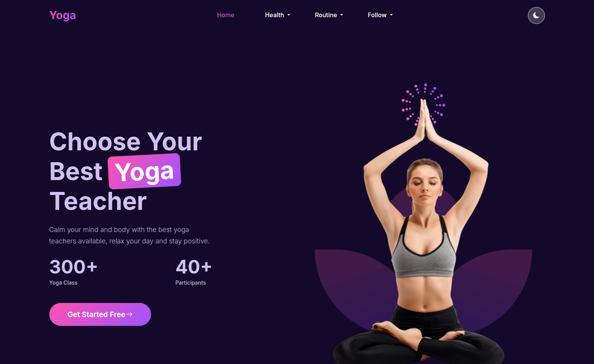

# 🌿 Yoga Harmony - Site Web Frontend



## 📋 Description
Ce projet est une **intégration frontend d'une maquette Figma pour un site web de yoga**.  
Il présente un design moderne et responsive pour promouvoir des cours de yoga et des instructeurs, avec des sections interactives incluant bannières hero, poses de yoga, feed Instagram et formulaire d'abonnement à la newsletter.

Le site inclut un **changement de thème clair/sombre**, des mises en page responsives et des interactions UI fluides.

## ✨ Fonctionnalités
- Design **entièrement responsive** (desktop, tablette, mobile)
- **Section hero** avec appel à l'action
- **Poses de yoga et statistiques**
- Section **Suivez-nous sur Instagram** avec mise en page interactive
- Formulaire d'**abonnement à la newsletter**
- **Basculement entre thème clair et sombre**
- Développé avec **Bootstrap 5** pour la mise en page et les composants responsives
- **Google Fonts (Inter)** pour la typographie
- **Bootstrap Icons** pour les icônes

## 🛠️ Technologies Utilisées
- **HTML5** - Structure du markup
- **CSS3 & Styles Personnalisés** - Styling et mise en page
- **Bootstrap 5** - Grille responsive et composants
- **JavaScript** - Basculement de thème et interactivité
- **Google Fonts (Inter)** - Typographie
- **Bootstrap Icons** - Icônes
- **Figma** - Prototype de design original

## 🚀 Installation et Utilisation

```bash
# Cloner le dépôt
git clone https://github.com/MedAmine2221/integration-bootstrap

# Se déplacer dans le répertoire du projet
cd integration-yoga

# Installer live-server (si nécessaire)
npm install

# Démarrer le serveur de développement
live-server

```bash
integration-bootstrap/
│
├── images/                # Images used in the project
├── style/
│   └── styles.css         # Custom CSS styles
├── script/
│   └── script.js          # JavaScript for interactivity
├── index.html             # Main HTML file
└── README.md              # Project documentation
